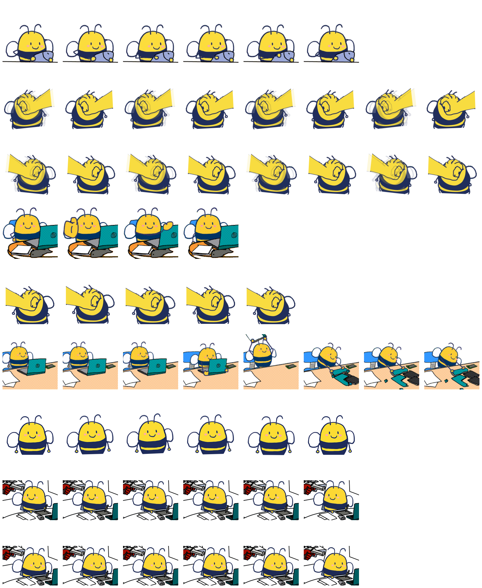

# 觅2 · Qoder 桌面宠物

自己画的蜂，做成 Qoder 桌宠包（petdex v1）：一张 8 列 × 9 行的精灵图，9 种状态。



## 安装

把 `dist/mi2/` 整个目录拷到 Qoder 的宠物目录下，然后**重启 Qoder**：

```
~/.petdex/pets/mi2/          # Windows: C:\Users\<你>\.petdex\pets\mi2\
├── pet.json
└── spritesheet.png
```

精灵图只在 Qoder 启动时读一次，不重启看不到变化。

## 内容

| 路径 | 说明 |
|---|---|
| `dist/mi2/spritesheet.png` | 精灵图 1536×1872，单元 192×208 |
| `dist/mi2/pet.json` | `{"id":"mi2","displayName":"觅2","spriteVersionNumber":1}` |
| `assets/` | 源素材：5 个场景 GIF（待机 / 工作 / 出错 / review / 挥手）、特写静图、表情包原图 |

## 9 种状态

| 行 | 名字 | 帧数 | | 行 | 名字 | 帧数 |
|---|---|---|---|---|---|---|
| 0 | idle 待机 | 6 | | 5 | failed 出错 | 8 |
| 1 | runningRight 向右跑 | 8 | | 6 | waiting 等待 | 6 |
| 2 | runningLeft 向左跑 | 8 | | 7 | running 干活中 | 6 |
| 3 | waving 招手 | 4 | | 8 | review 审查 | 6 |
| 4 | jumping 被抓住 | 5 | | | | |

每行的帧数和播放节奏由 Qoder 运行时写死，包侧改不了；没用到的列留透明即可。

## 格式约束

8 列 × 9 行；`cellWidth × 13 == cellHeight × 12`（本宠 192 × 208），且 `cellW ≥ 48`、`cellH ≥ 52`；
文件 ≤ 32 MB；`pet.json` 的 `id` 必须等于目录名；`spritesheet.png` 与 `spritesheet.webp` 只能存在一个。

在线预览：<https://mi2-pet-animations-e952iuq3fe9.qoder.website>
